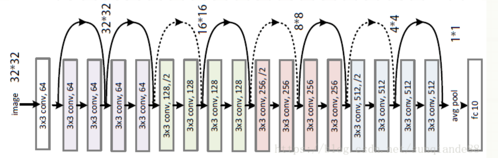

# ResNet 

## Environment
* [Docker](https://ngc.nvidia.com/catalog/containers/nvidia:tensorflow) NVIDIA-NGC-Tensorflow

## To run
[Host]
$ docker run --gpus all -it --rm -v PATH/TO/HOST/IPYNB:PATH INSIDE/docker_container -p 8888:8888 

[docker-container] $ jupyter notebook --ip 0.0.0.0 --port 8888 --no-browser --allow-root

[Host] http://localhost:8888/ in your browser

## ResNet 18 

